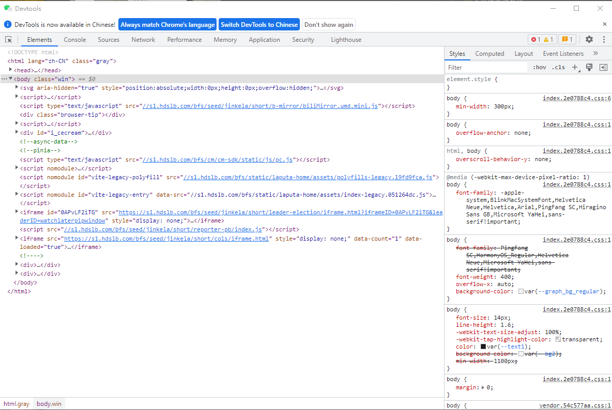
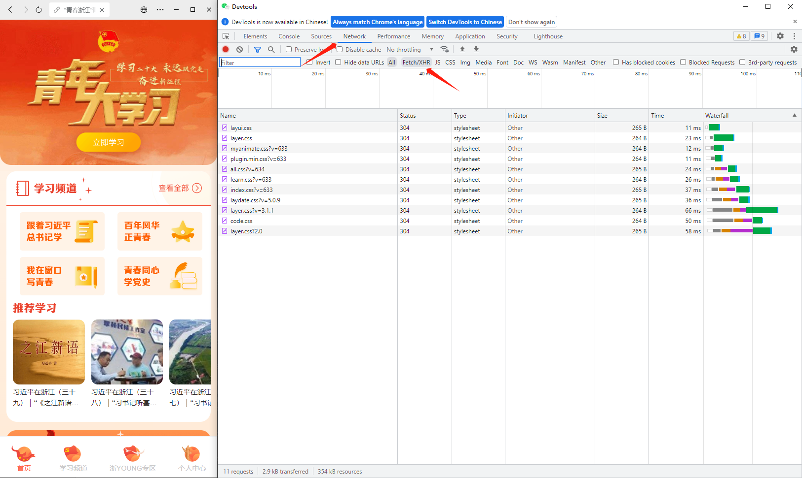
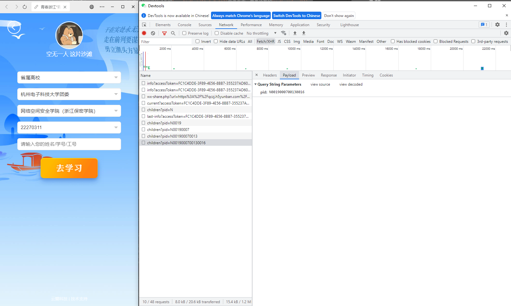
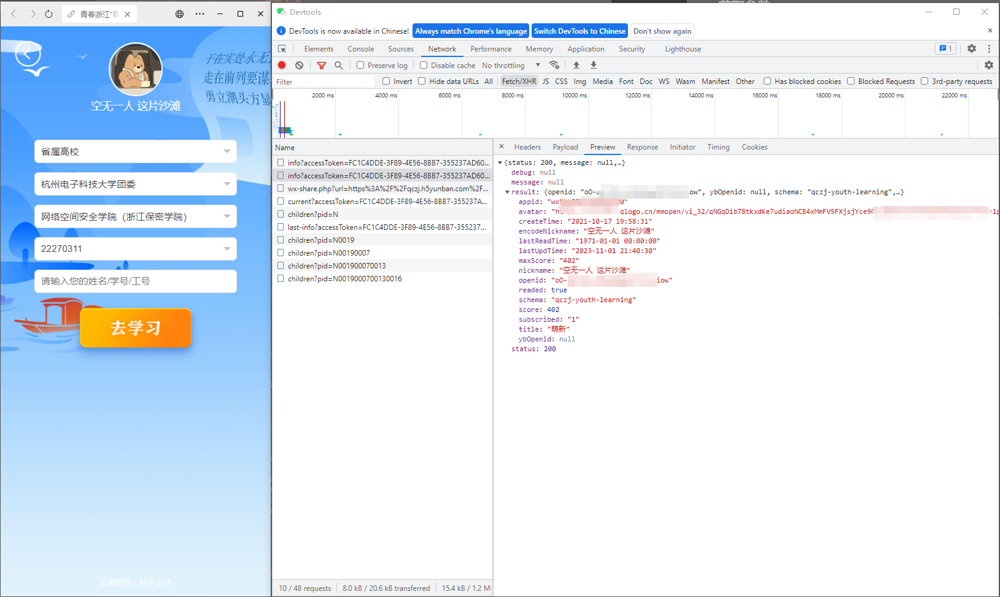

# WeChat DevTools

用于调试微信浏览器

仅支持微信Version 3.9.7.29

## 安装

将发行的`WeChatWin.dll`放入微信的安装路径下的`.../WeChat/[3.9.7.29]`文件夹内，覆盖原有的`WeChatWin.dll`文件, 原有的`WeChatWin.dll`文件请自行备份。

## 使用

打开微信浏览器, 点击右上角三个点, 选择`检查`, 即可打开控制台

    
    

## 获取参数

以浙江为例
使用微信浏览器打开青年大学习界面

打开控制台, 首先点击Network, 然后点击Fetch/XHR

    

点击立即学习，进入到选择学校班级的界面，按实际情况选好后查看控制台

此时点击最新的一条请求，查看即可获得`nid`

    

而`cardNo`就是你打算输入的`姓名/学号/工号`

`openid`是你的微信openid, 点开前几条并展开预览就可以看到

    

